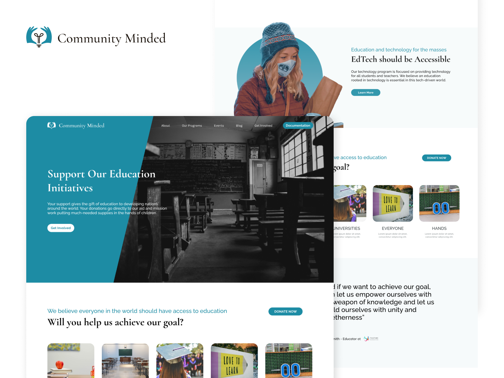

# Community Minded 
A modern theme built with non-profit educational organizations in mind. This theme is designed to be professional and easy to use while still boasting page templates for volunteer sign-ups, donations, event sign-ups, and more.

## Feature Highlights of Community Minded:

- Fully responsive and mobile-friendly design
- Drag-and-drop modules
- Fully customizable
- Homepage template
- Landing page template
- Events page template
- Individual event registration page template
- Donation page template
- Volunteer sign-up page template
- About page template
- Contact Us page template
- Pillar page template
- Shopping page template
- Learning page template
- Blog listing template
- Blog post template
- All system page templates
- Product module
- Donation module
- Newsletter signup module
- Campaign and stat module
- Shopping module
- Video and image modules
- Frequently asked questions (FAQ) module
- Masonry gallery and gallery module
- Several text modules with buttons
- Customizable hero module
- Form module
- All modules are lazy load ready
- Free Google Fonts
- Native HubSpot design
- Built using a modern and professional design language
- Open-source theme
- This theme incorporates the best practice recommendations and code formatting of the HubSpot CMS Boilerplate open-source theme.
